# Цель работы

Пройти первый этап "Безопасность в сети" внешнего курса "Основы кибербезопасности"

# Задание

Изучить:

- Как работает Интернет и базовые сетевые протоколы

- Как достигается персонализация пользователя в Сети

- Какие механизмы существуют для анонимизации пользователя в сети

- Как обеспечивается безопасность в беспроводных сетях

# Теоретическое введение

Модель TCP/IP состоит из 4 уровней. Прикладной уровень отвечает за взаимодействие пользовательских программ (например, браузеров через HTTP/HTTPS или почтовых клиентов через SMTP) с интернет-сервисами. Транспортный уровень (TCP и UDP) обеспечивает надежную или быструю передачу данных между процессами на разных устройствах. Сетевой уровень (IP) управляет маршрутизацией пакетов между различными физическими сетями, а канальный уровень (Ethernet, Wi-Fi) обеспечивает физическую передачу данных. Вся эта многоуровневая система позволяет преобразовать запрос пользователя (например, ввод адреса yandex.ru) в загрузку веб-страницы, проходя последовательно все этапы обработки данных.

Персонализация в сети достигается с помощью файлов cookie, которые передаются от сервера к браузеру пользователя для его идентификации. Куки позволяют сохранять пользовательские данные, такие как сессионная информация (например, содержимое корзины в интернет-магазине) или предпочтения (например, выбор языка страницы). Однако они также могут использоваться для отслеживания действий пользователя, что позволяет рекламным сервисам показывать персонализированную рекламу на разных сайтах. Куки бывают сессионными (удаляются после закрытия браузера) и постоянными (сохраняются для аутентификации и сбора статистики), а также различаются по источнику — прямые (от посещаемого сайта) и сторонние (от рекламных сервисов). Блокировка сторонних cookie повышает приватность, но полный отказ от них значительно снижает удобство работы в сети, так как требует постоянной повторной авторизации.

Tor — это сеть, обеспечивающая анонимность и конфиденциальность пользователей через луковую маршрутизацию, где данные последовательно шифруются и передаются через три узла: охранный, промежуточный и выходной. В отличие от классической маршрутизации, ни один узел (кроме охранного и выходного) не знает полного пути пакета, что исключает отслеживание отправителя и получателя. Конфиденциальность достигается за счёт многослойного шифрования: каждый узел расшифровывает только свой "слой", подобно очистке лука, и передаёт данные дальше. Хотя Tor эффективно скрывает IP-адрес пользователя, замедляя соединение, он не гарантирует абсолютной анонимности из-за возможных атак и блокировок в некоторых странах. Браузер Tor, внешне похожий на обычные браузеры, маскирует местоположение пользователя, подменяя его IP-адресом выходного узла, что делает его популярным инструментом для приватного серфинга, несмотря на спорные аспекты использования.

Безопасность в беспроводных сетях (WiFi) обеспечивается через шифрование и аутентификацию, реализуемые стандартами WPA, WPA2 и WPA3, которые пришли на смену уязвимому WEP. Современные алгоритмы используют AES-шифрование с ключами длиной от 128 бит, генерируемыми на основе пароля пользователя, что защищает передаваемые данные от перехвата. Аутентификация может быть двух типов: Personal (домашние сети с паролем) и Enterprise (корпоративные сети с серверной проверкой доступа). Важным свойством WPA3 является устойчивость к атакам на слабые пароли и forward secrecy, предотвращающая компрометацию прошлых сессий при утечке ключа. WiFi работает на канальном уровне модели TCP/IP, обеспечивая беспроводную передачу данных по радиоканалу, аналогично проводному Ethernet, но с дополнительными механизмами защиты от помех и несанкционированного доступа.

# Выполнение внешнего курса

## Как работает интернет: базовые сетевые протоколы

HTTPS – единственный протокол из списка, относящийся к прикладному уровню.

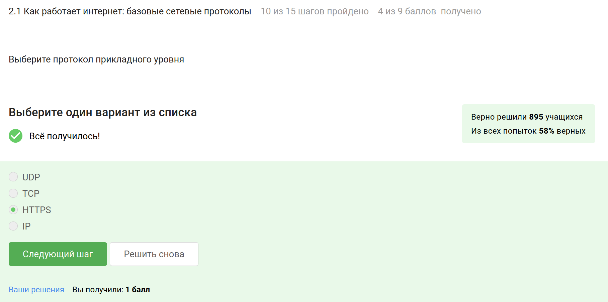

TCP работает на транспортном уровне (4-й уровень OSI). Он обеспечивает надежную доставку данных, например, для HTTP или FTP.

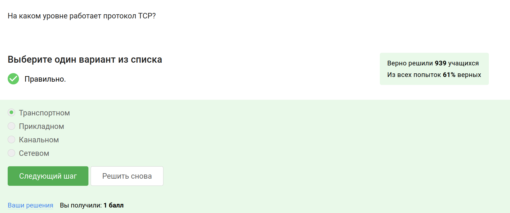

Корректными являются ответы, в которых числа < 255.

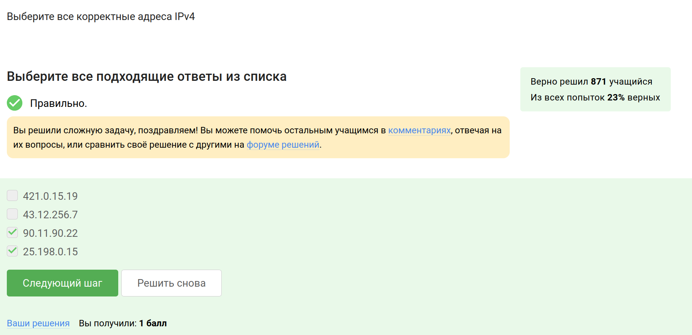

DNS сервер сопоставляет IP адреса доменным именам. Остальные функции не относятся к DNS (сегментация данных выполняется на транспортном уровне протоколом TCP, выбор маршрута пакета - задача сетевого уровня и маршрутизаторов, адресация на хосте осуществляется протоколами канального уровня типа ARP) 

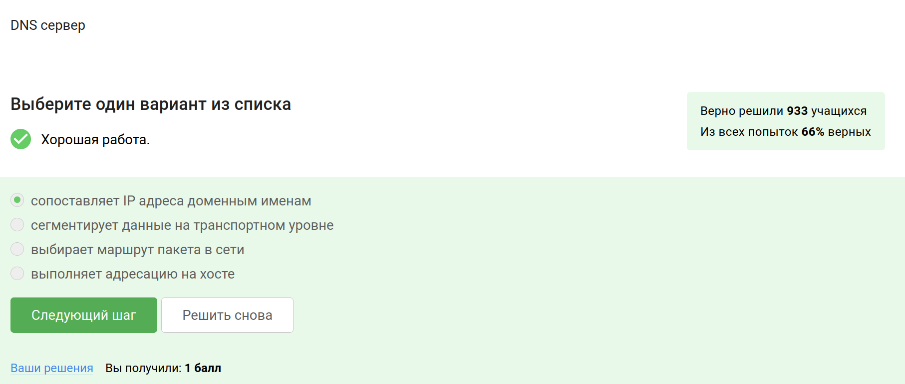

Правильная последовательность: прикладной — транспортный — сетевой — канальный, другие варианты нарушают порядок уровней.

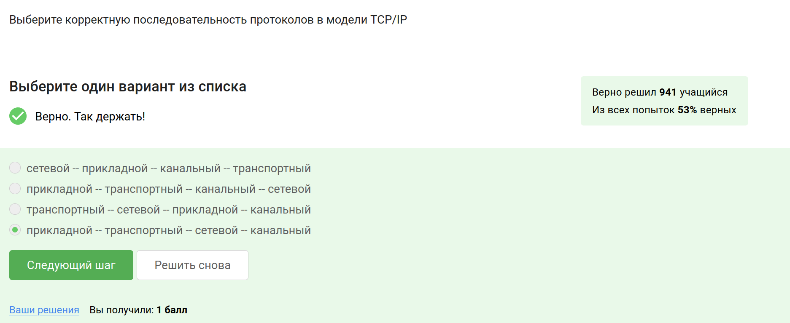

Протокол HTTP передает данные между клиентом и сервером в открытом виде, без шифрования.

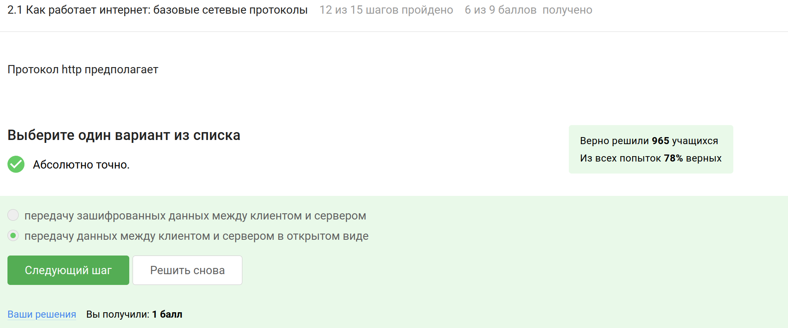

Протокол HTTPS включает две основные фазы: рукопожатие (TLS handshake), где происходит аутентификация сервера и согласование параметров шифрования, и передачу данных, которая осуществляется в зашифрованном виде.

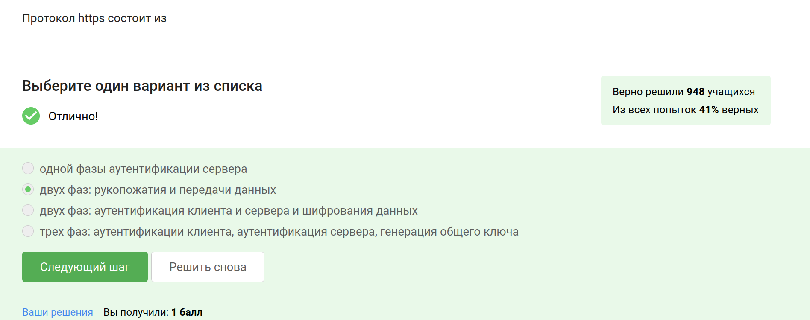

Версия протокола TLS определяется в процессе переговоров между клиентом и сервером: клиент предлагает поддерживаемые версии, а сервер выбирает наиболее безопасную из доступных обоим.

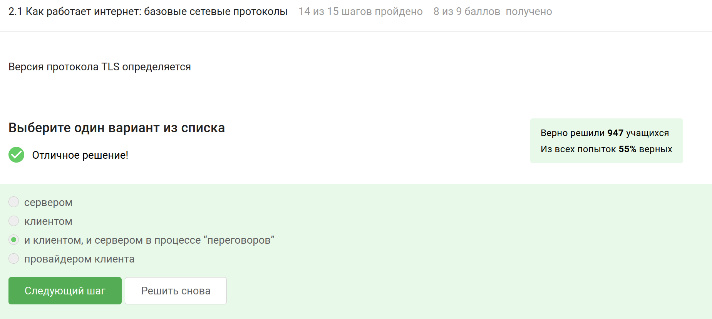

В фазе "рукопожатия" TLS предусмотрено формирование общего секретного ключа, аутентификация сервера (и опционально клиента), а также согласование алгоритмов шифрования. Шифрование данных начинается только после завершения рукопожатия, поэтому сам процесс проходит в открытом виде. 

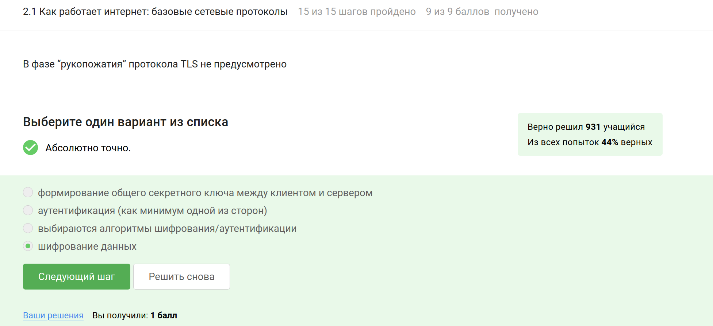

## Персонализация сети

Куки хранят идентификатор сессии или уникальный идентификатор пользователя для аутентификации и отслеживания состояния сеанса. Но они не должны содержать пароли или IP-адреса, так как это нарушает безопасность и конфиденциальность. 

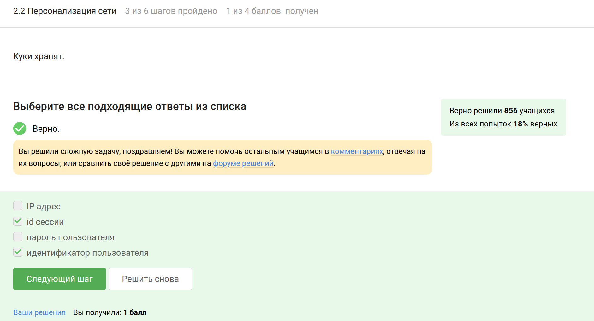

Куки не используются для улучшения надежности соединения, так как это техническая задача, решаемая на уровне протоколов.

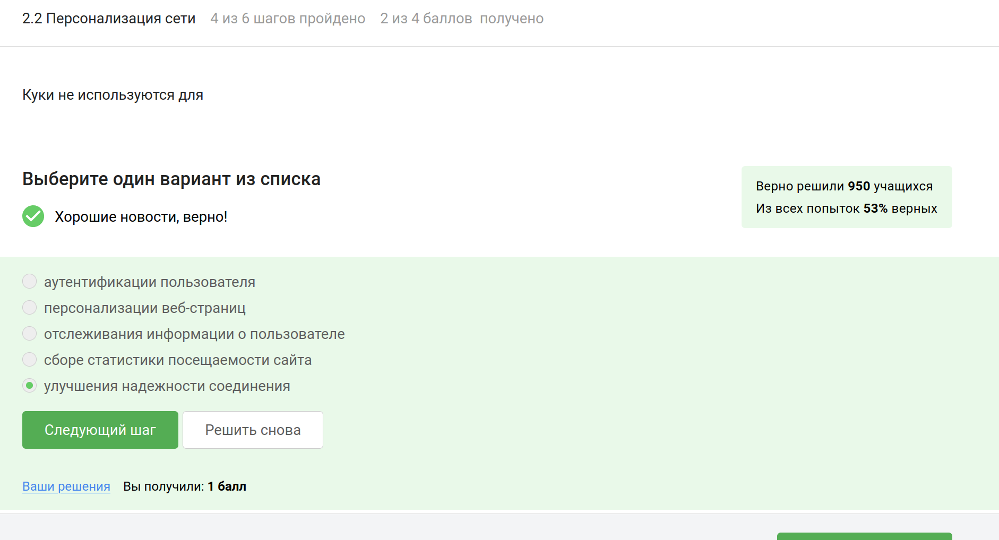

Клиент лишь хранит и передаёт куки, но не генерирует их самостоятельно, куки создаются сервером.

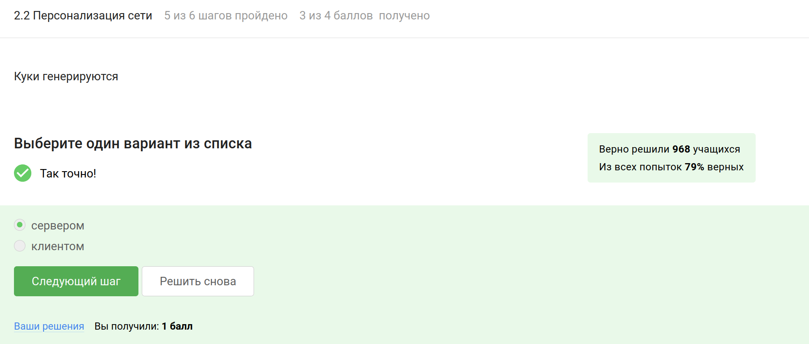

Сессионные куки хранятся в браузере только во время текущей сессии и удаляются после закрытия вкладки или браузера.

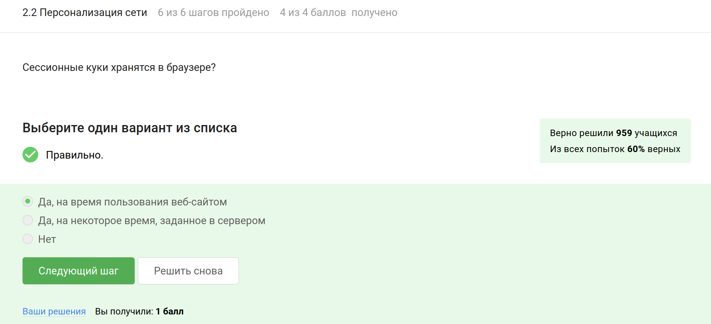

## Браузер TOR. Анонимизация

В сети Tor трафик проходит через три промежуточных узла (guard relay, middle relay и exit relay), что обеспечивает анонимность.
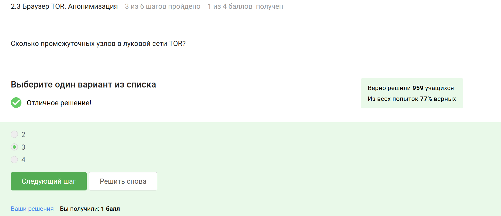

IP-адрес получателя известен отправителю и выходному узлу, так как он завершает цепочку и передаёт трафик в открытую сеть.

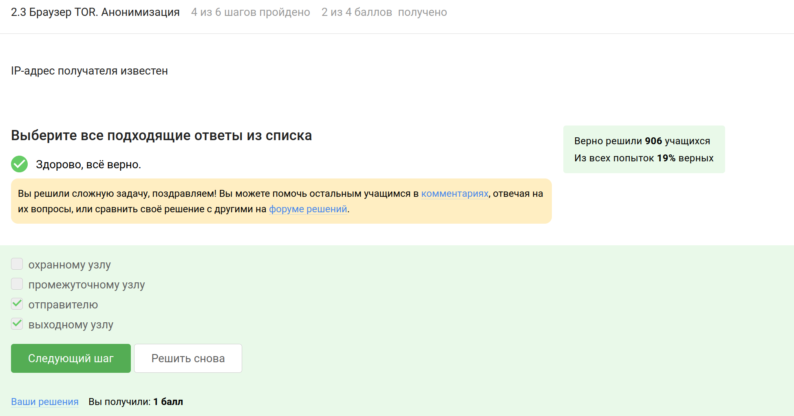

При использовании onion routing общий секретный ключ для каждого "слоя" шифрования генерируется отправителем для каждого узла.

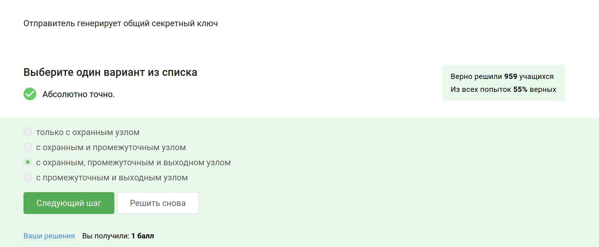

Браузер Tor служит для повышения конфиденциальности, но не является обязательным для успешной доставки пакетов. 

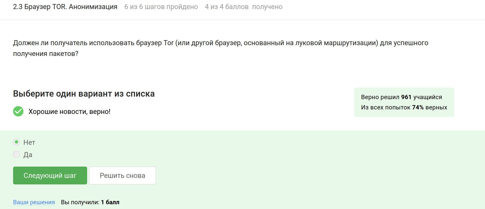

## Беспроводные сети Wi-fi

Wi-Fi позволяет устройствам подключаться к локальным сетям и интернету без проводов, используя радиочастотные сигналы, что соответствует стандартам, установленным IEEE 802.11. Остальные варианты не подходят.

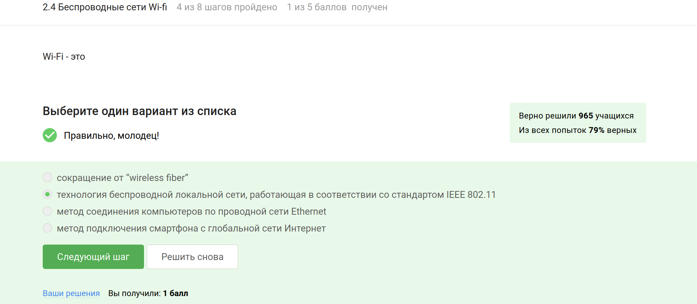

Протокол Wi-Fi работает на канальном уровне модели OSI, обеспечивая беспроводную передачу данных между устройствами в локальной сети, а также отвечает за доступ к среде передачи и управление потоком данных.

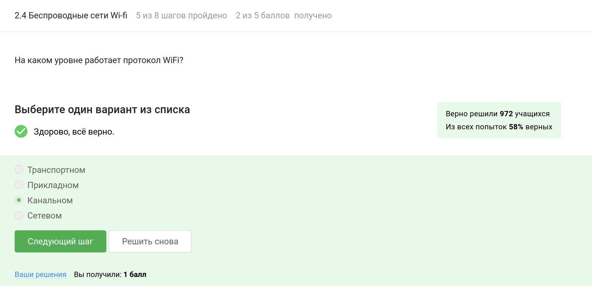

WEP является устаревшим и небезопасным методом шифрования для Wi-Fi, поскольку его алгоритмы легко поддаются взлому.

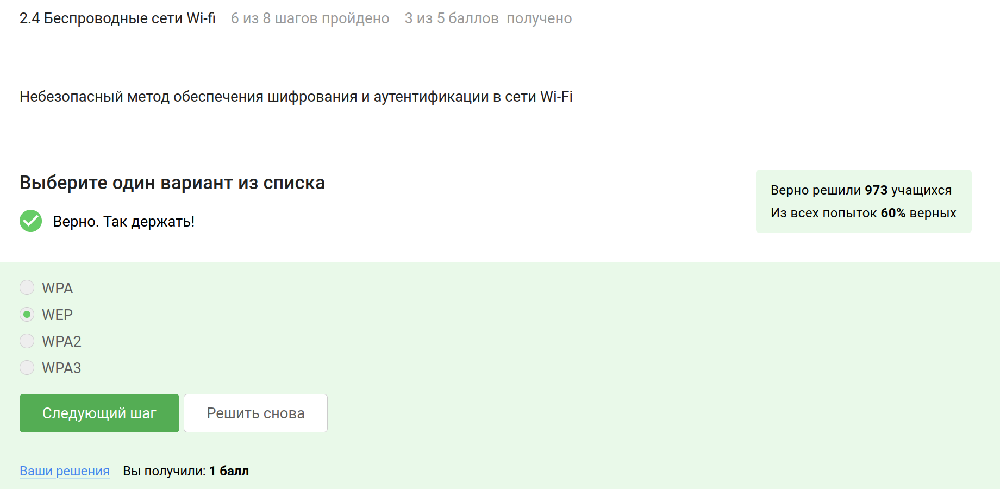

При использовании современных протоколов безопасности Wi-Fi, таких как WPA2 или WPA3, данные шифруются после того, как устройства проходят процесс аутентификации, что обеспечивает конфиденциальность и защиту информации. 

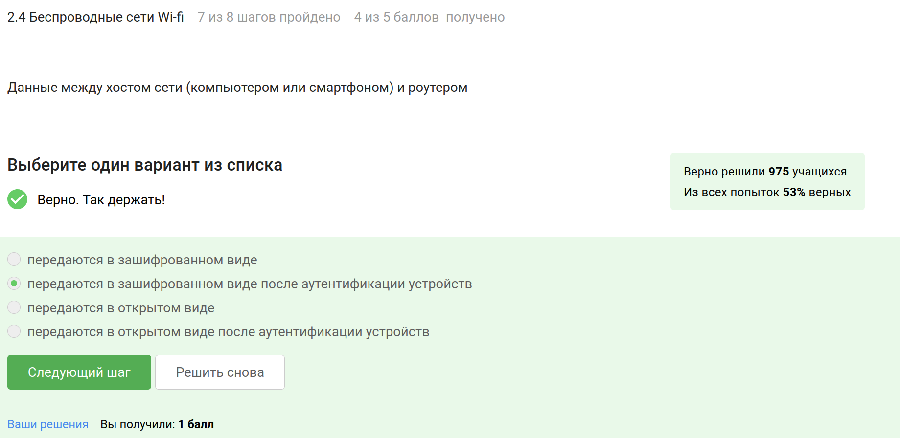

Этот метод аутентификации предназначен для домашних и небольших офисных сетей, обеспечивая простоту настройки и использования с одним паролем для доступа. 

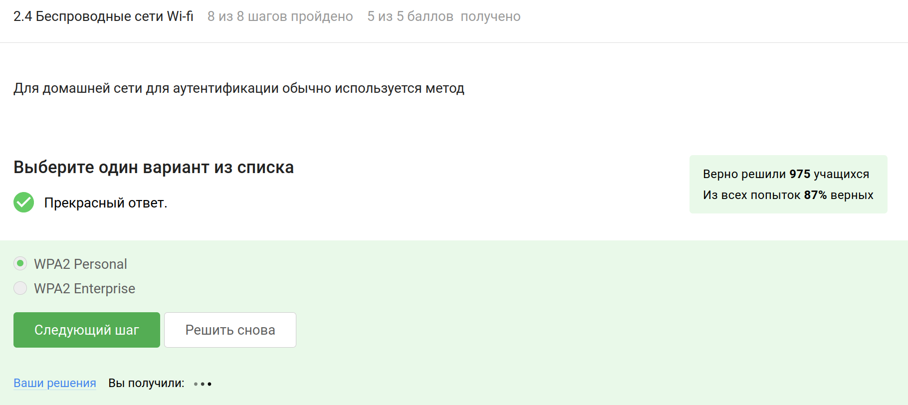

# Выводы

Я прошла первый этап "Безопасность в сети" внешнего курса "Основы кибербезопасности" и изучила работу Интернета и базовых сетевых протоколов
