# Цель работы

Пройти второй этап "Защита ПК/телефона" внешнего курса "Основы кибербезопасности"

# Задание

Изучить:

- Как шифруются носители информации и зачем это нужно

- Как пароли хранятся на серверах

- Какие типы фишинговых рассылок бывают и как их можно избежать

- Как достигается безопасность сообщений в современных мессенджерах

# Теоретическое введение

Шифрование носителей информации защищает данные от утечки при потере или краже устройства, делая их недоступными без ключа. Процесс включает генерацию ключа шифрования (например, с помощью алгоритма AES), который затем используется для преобразования данных в зашифрованную форму; для доступа требуется пароль, разблокирующий ключ. Современные системы используют аппаратное ускорение (TPM-модули) для эффективного шифрования без заметного замедления работы. Шифровать можно как весь диск, так и отдельные его части, включая загрузочный сектор, что требует ввода пароля при включении устройства. Ключи рекомендуется хранить отдельно от зашифрованного носителя — у администратора, на физических токенах или в защищённых облачных сервисах, а для шифрования используются как встроенные утилиты (BitLocker, FileVault, LUKS), так и сторонние решения (VeraCrypt, PGPDisk).

Стойкость пароля определяется сложностью его перебора: чем длиннее пароль и чем разнообразнее используемые символы (цифры, буквы, спецзнаки), тем он надежнее. Для защиты от атак применяются ограничения на попытки ввода, капчи (тесты на человечность) и хранение паролей на серверах в виде хэшей — криптографических преобразований (SHA2, SHA3, ГОСТ), которые невозможно обратить. Дополнительную защиту слабых паролей обеспечивает «соль» — случайные данные, добавляемые к паролю перед хэшированием, что исключает использование заранее подготовленных таблиц хэшей. Для безопасного хранения паролей рекомендуется использовать менеджеры паролей (KeePassXC, Keychain Access), запоминая только один мастер-пароль, а также избегать повторного использования паролей на разных сервисах. Регулярная смена паролей и проверка их на утечки (например, через haveibeenpwned.com) минимизируют риски компрометации данных.

Фишинг — это кибератака, направленная на получение конфиденциальных данных путём маскировки под доверенные сервисы (сайты, банки, почтовые сервисы). Основные виды включают адресный фишинг (поддельные ссылки в письмах), телефонный фишинг (мошеннические звонки) и календарный фишинг (вредоносные события). Технологии вроде SPF и DMARC помогают бороться с email-спуфингом (подменой отправителя), но не исключают человеческий фактор. Ключевая защита — критическая проверка подозрительных писем, ссылок (особенно с HTTP вместо HTTPS) и отправителей. Использование надёжных почтовых сервисов с фильтрами спама и обучение цифровой грамотности снижают риски успешных атак.

Компьютерные вирусы представляют собой вредоносные программы различных типов, каждый из которых имеет специфические механизмы распространения и воздействия. Почтовые черви (например, Mydoom и Sobig) распространяются через электронную почту, маскируясь под легитимные сообщения и заражая системы при открытии вложений. Программы-вымогатели (такие как WannaCry) шифруют данные пользователей и требуют выкуп за их расшифровку, используя уязвимости в операционных системах. Троянские программы (включая Flashback и Pegasus) маскируются под полезное ПО, но выполняют скрытые вредоносные действия, такие как кража данных или шпионаж. Основными мерами защиты являются регулярное обновление ПО, создание резервных копий данных и внимательное отношение к разрешениям, запрашиваемым приложениями.

Современные мессенджеры обеспечивают безопасность сообщений через пять ключевых принципов: целостность данных (точность передачи), конфиденциальность (шифрование), аутентификацию (подтверждение отправителя), устойчивость к потерям (доставка при восстановлении связи) и прямую секретность (защита прошлых сообщений при компрометации ключа). Сквозное шифрование (E2EE) реализуется через обмен открытыми ключами и генерацию общих сессионных ключей, что исключает доступ сервера к содержимому сообщений. Протокол Signal, лежащий в основе многих мессенджеров, использует динамическое обновление ключей для обеспечения как прямой секретности, так и восстановления безопасности после компрометации. Групповые чаты шифруются через индивидуальные ключи участников, где каждое сообщение шифруется ключом отправителя и расшифровывается получателями своими копиями этого ключа. Математическая сложность восстановления общих ключей из открытых данных гарантирует стойкость шифрования даже при перехвате трафика.

# Выполнение внешнего курса

## Шифрование диска

Зашифровать загрузочный сектор диска можно с помощью различных средств шифрования, таких как BitLocker для Windows или LUKS для Linux, что позволяет защитить данные и предотвратить несанкционированный доступ.

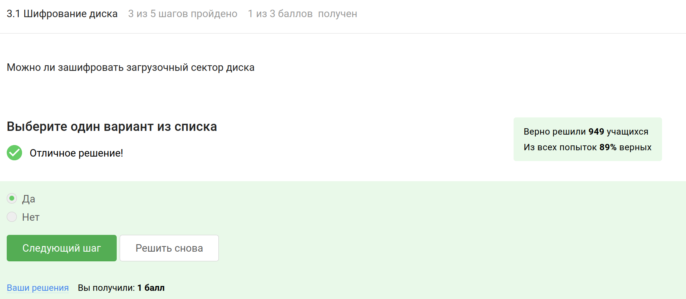

Шифрование диска обычно использует симметричное шифрование, при котором один и тот же ключ используется как для шифрования, так и для дешифрования данных.

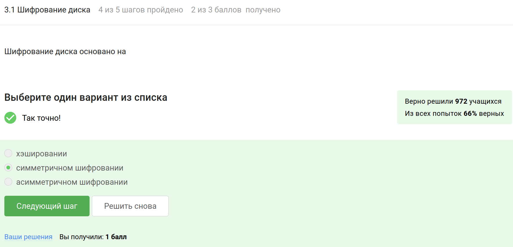

VeraCrypt является бесплатным и открытым решением, а BitLocker встроен в операционные системы Windows и обеспечивает шифрование дисков на уровне всей системы.

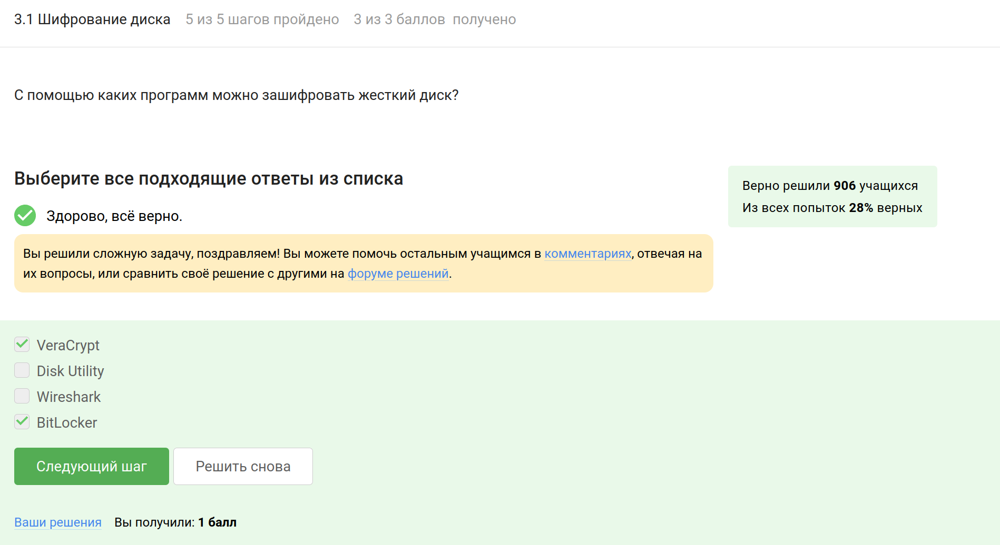

## Пароли

Пароль "UQr9@j4!S$" считается стойким, так как он сочетает в себе заглавные буквы, строчные буквы, цифры и специальные символы, что делает его более защищенным от взлома.

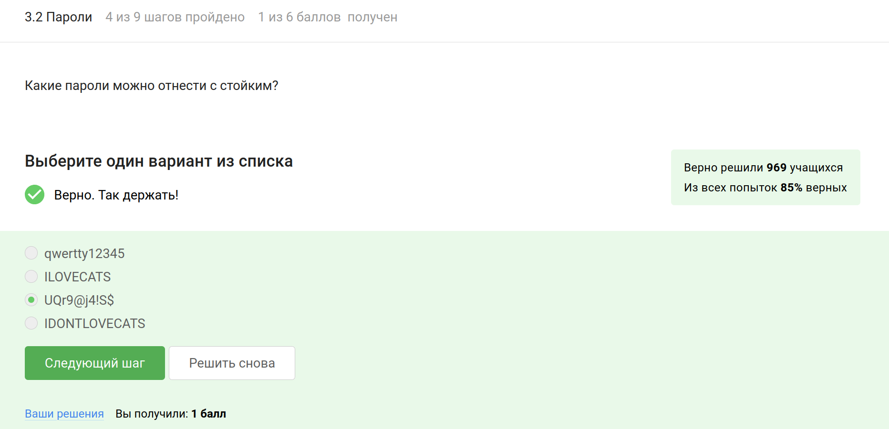

Менеджеры паролей обеспечивают безопасное хранение и шифрование паролей, что значительно снижает риск их кражи.

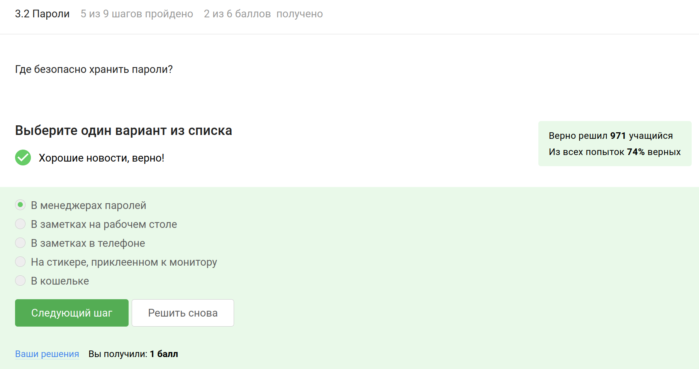

Капча используется для различения человека от автоматизированных программ и предотвращения злоумышленников от совершения действий, таких как спам или брутфорс-атаки.

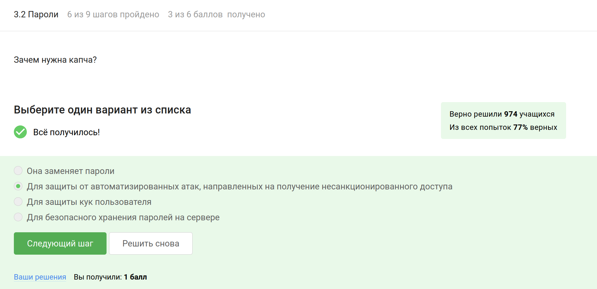

Хэширование паролей обеспечивает безопасность, так как даже в случае утечки данных хэшированные пароли нельзя легко восстановить в их исходном виде.

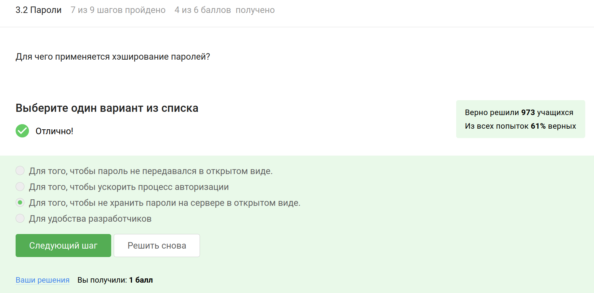

Вообще соль помогает предотвратить атаки с использованием радужных таблиц и обеспечивает уникальность хэшей, но если злоумышленник уже получил доступ к серверу и хэшам паролей, добавление соли не поможет улучшить стойкость паролей к атакам, так как у него все равно будет доступ к этим дополнительным данным.

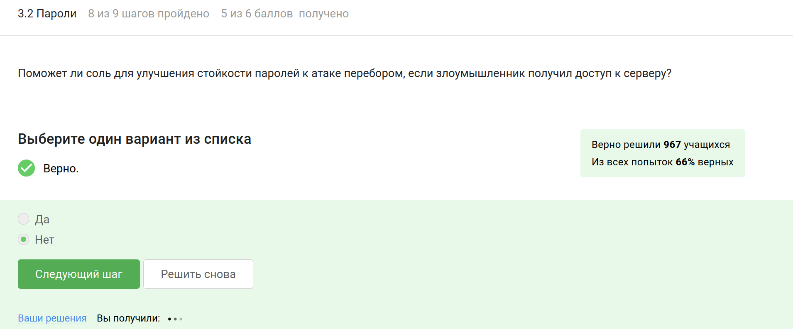

Каждая из этих мер поможет избежать атаки перебором:
разные пароли сохранят аккаунты, даже если один из них был взломан;
аналогично поможет периодическая смена паролей (если они надежные);
сложные и длинные пароли труднее подобрать перебором;
капча затруднит процесс.

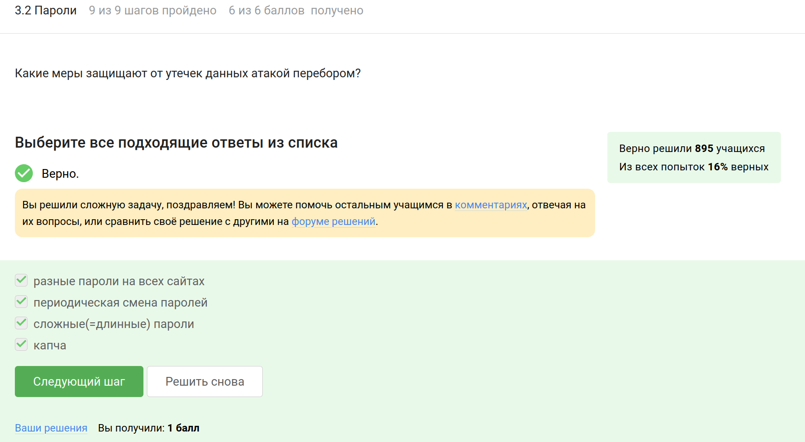

## Фишинг

Фишинговыми являются ссылки, которые не ведут на официальные сайты, а имитируют их. Таким образом https://online.sberbank.wix.ru/CSAFront/index.do - это фишинговая ссылка, так как домен содержит "wix.ru", который указывает на бесплатный конструктор сайтов, а не на официальный сайт Сбербанка. И https://passport.yandex.ucoz.ru/auth?origin=homedesktopru также является фишинговой, так как домен "ucoz.ru" не является официальным доменом Яндекса

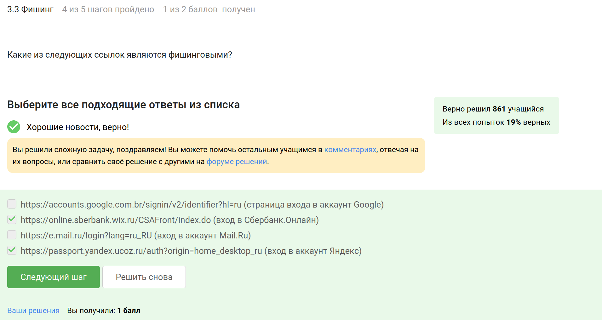

Может, так как злоумышленники могут подделать адрес отправителя (или взломать его)

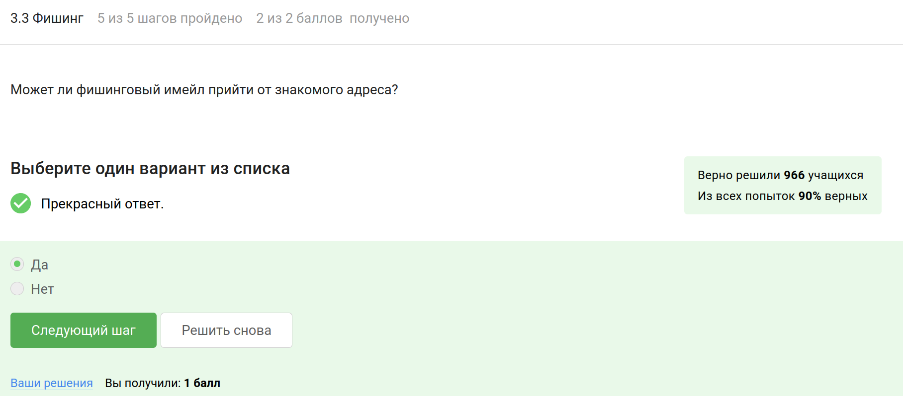

## Вирусы

Это метод, который злоумышленники используют для подделки адреса отправителя, чтобы сделать имейл более убедительным и обмануть получателя, заставив его думать, что сообщение пришло от надежного источника.

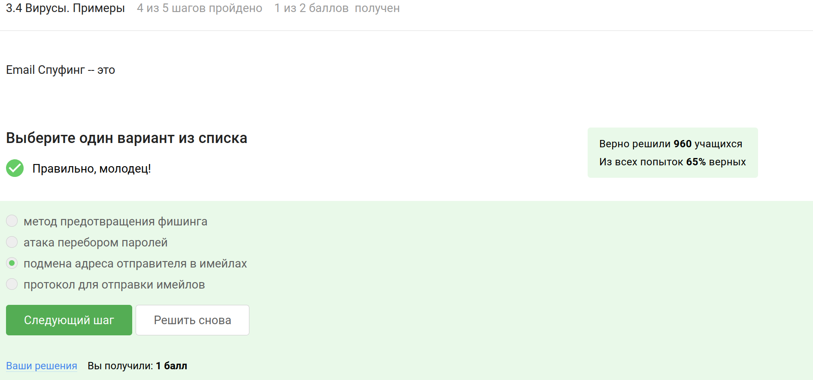

Оправдывая свое название, этот вирус скрывает свое истинное предназначение, представляясь легитимным программным обеспечением.

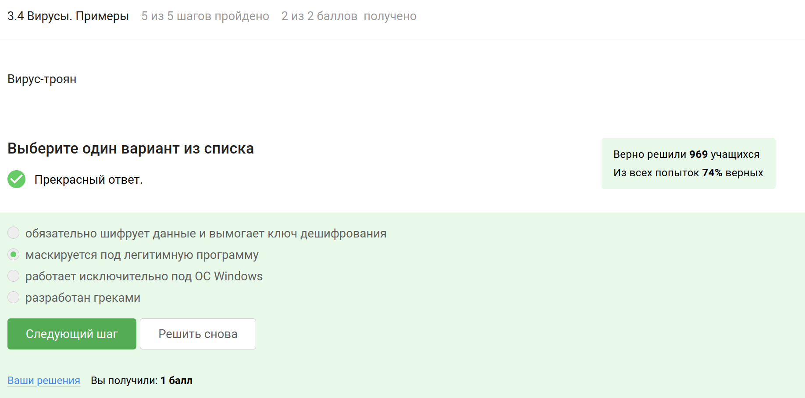

В протоколе Signal ключ шифрования формируется при отправке первого сообщения, что обеспечивает создание уникальных ключей для безопасной связи между сторонами.

## Безопасность мессенджеров

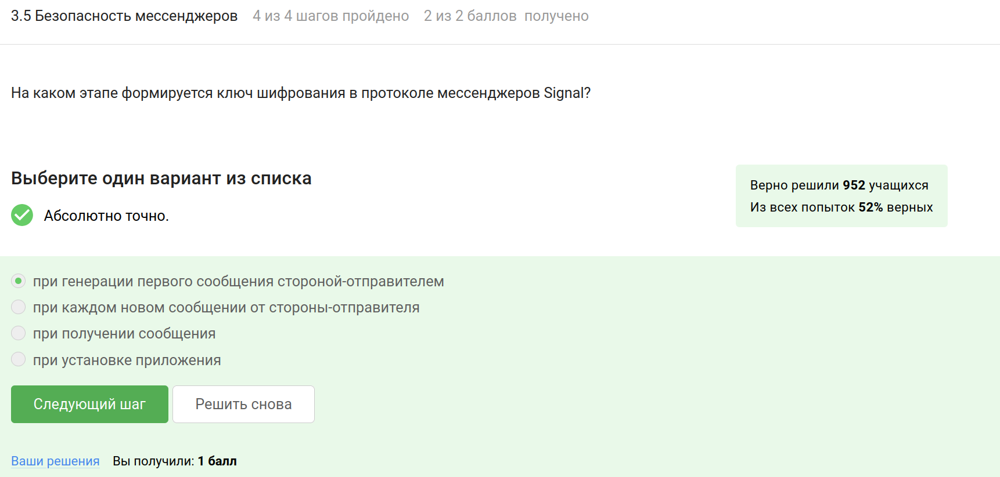

Суть сквозного шифрования заключается в том, что только отправитель и получатель могут расшифровать сообщения, находящиеся в зашифрованном виде в процессе передачи через серверы, которые не имеют доступа к их содержимому.

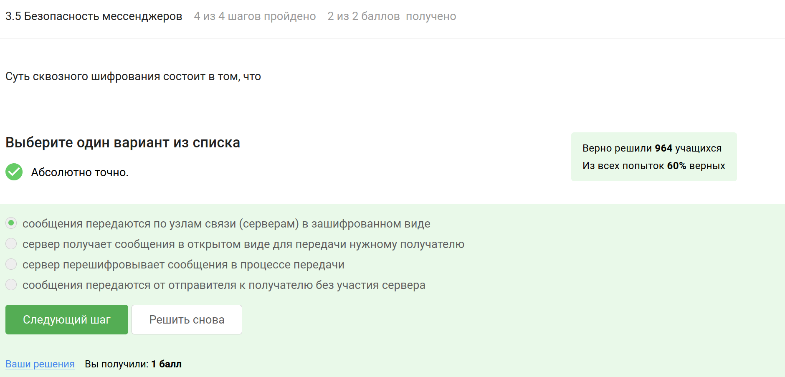

# Выводы

Я прошла второй этап "Защита ПК/телефона" внешнего курса "Основы кибербезопасности" и изучила, как шифруются носители информации и зачем это нужно.

