# Цель работы

Пройти третий этап "Криптография на практике" внешнего курса "Основы кибербезопасности"

# Задание

- Научиться различать основные криптографические протоколы – симметричное шифрование, аутентификацю, цифровую подпись и хэширование.

- Узнать, как устроены электронные платежи

- Разобраться в системе блокчейн: как она строится, какую задачу в информатике решает

# Теоретическое введение

Криптография делится на симметричную и асимметричную: в симметричной криптографии стороны используют общий секретный ключ (например, для шифрования или аутентификации), а в асимметричной — пару из открытого и закрытого ключей (например, для цифровой подписи или обмена ключами). Криптографические хэш-функции — это бесключевые примитивы, обеспечивающие целостность данных и стойкость к коллизиям. Симметричное шифрование обеспечивает конфиденциальность, а цифровая подпись — аутентификацию, целостность и неотказуемость. Современные протоколы часто комбинируют симметричные и асимметричные методы для эффективности и безопасности.

Электронно-цифровая подпись (ЭЦП) обеспечивает три ключевых свойства: целостность сообщения (позволяет обнаружить изменения), аутентификацию (подтверждает авторство) и неотказуемость (исключает отказ от подписи). Основные применения ЭЦП — проверка подлинности обновлений ПО (верификация подписи разработчика) и сертификация открытых ключей через удостоверяющие центры (например, стандарт X.509). Алгоритм ЭЦП включает три этапа: генерацию ключевой пары (открытый и закрытый ключи), создание подписи с помощью закрытого ключа и её проверку через открытый ключ. Безопасность схемы требует, чтобы злоумышленник не мог подделать подпись, даже зная открытый ключ и имея доступ к другим подписанным сообщениям. Популярные алгоритмы ЭЦП — RSA, ECDSA и ГОСТ Р 34.10-2012, а юридическая значимость подписи зависит от её типа (простая, усиленная неквалифицированная или квалифицированная).

Электронные платежи включают два основных этапа: авторизацию (криптографическую проверку) и транзакцию (перевод средств). Авторизация при оплате картой (CP) требует физического присутствия карты и PIN-кода, который используется для создания цифровой подписи, проверяемой банком-эмитентом. Для онлайн-платежей (CNP) применяется протокол 3-D Secure, где участвуют три домена: банк-эмитент, платежная система и продавец, а аутентификация происходит через многофакторную проверку (например, SMS-код). Безопасность обеспечивается за счет TLS-шифрования, разделения запрашиваемых данных (PIN — для офлайн, CVV — для онлайн) и обязательной двухфакторной аутентификации для онлайн-операций. Таким образом, система электронных платежей сочетает криптографические методы и многоуровневую проверку для защиты от мошенничества.

Блокчейн — это децентрализованная система, обеспечивающая неизменяемый публичный реестр транзакций (ledger) без участия доверенных третьих сторон. Его ключевые свойства включают постоянство данных, консенсус между участниками, живучесть (возможность добавления новых блоков) и открытость (доступность для любого участника). Для достижения консенсуса используются криптографические механизмы, такие как доказательство работы (PoW), где майнеры решают вычислительно сложные задачи (например, подбор хэша с заданным числом нулей), чтобы добавить блок и получить вознаграждение. Альтернативные механизмы, такие как доказательство доли владения (PoS), решают проблему энергозатратности PoW, но вводят зависимость от финансовой доли участника в системе. Блокчейн обеспечивает безопасность транзакций за счет цифровых подписей (подтверждающих авторство) и криптографической защиты от двойного расходования средств.

# Выполнение внешнего курса

## Введение в криптографию

В асимметричной криптографии одна сторона использует свой открытый ключ для шифрования данных, в то время как другая сторона использует свой секретный ключ для их расшифровки. Почему тут правильный ответ пара (как в симметричном шифровании) я без понятия ._. 

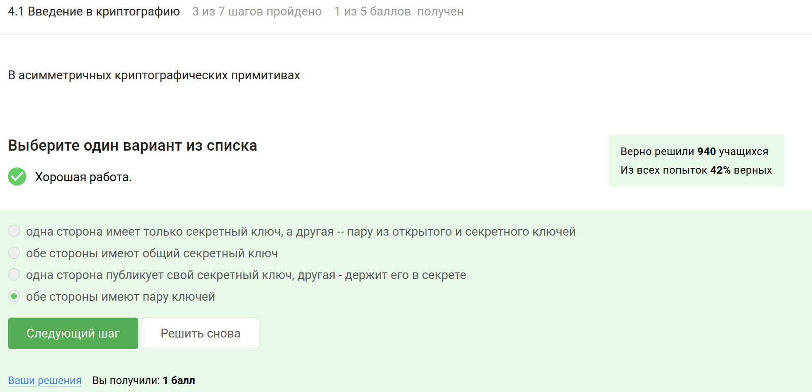

Криптографическая хэш-функция должна быть быстрой для вычисления, чтобы ее можно было применять на практике; независимо от размера входных данных, результат всегда будет иметь фиксированный размер и сложно найти два различных набора входных данных, которые дают один и тот же хэш.

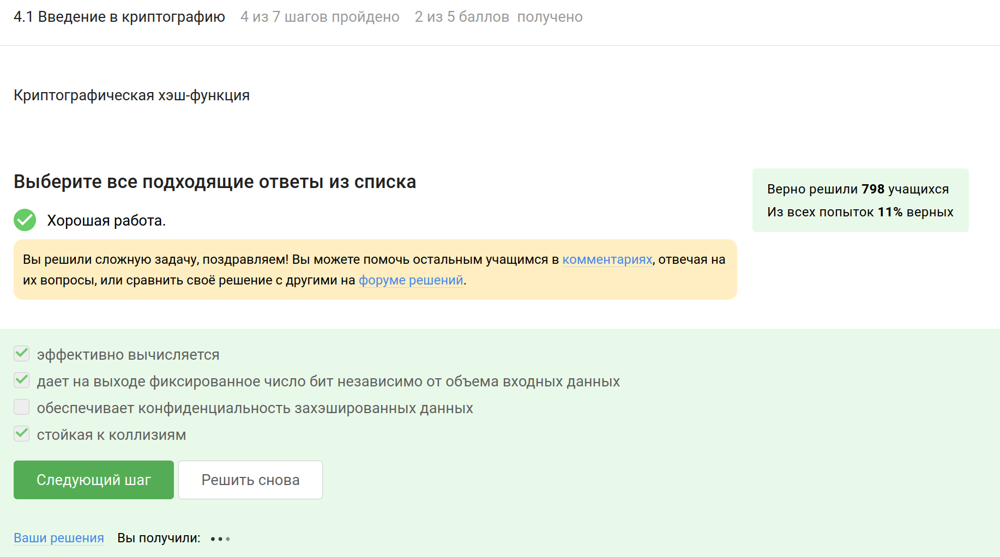

AES и SHA2 не являются алгоритмами цифровой подписи: AES — это симметричный шифровальный алгоритм, а SHA2 — это криптографическая хэш-функция. А все остальные - алгоритмы цифровой подписи.

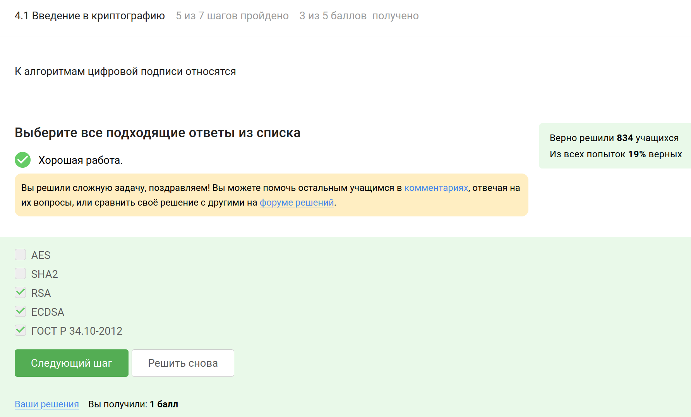

Код аутентификации сообщения обычно создается с использованием симметричного ключа, который известен обеим сторонам.

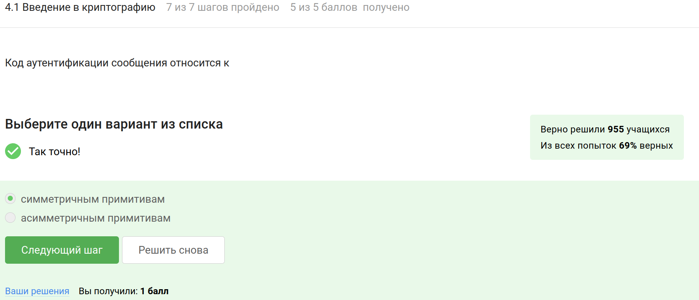

Обмен ключами Диффи-Хэллмана позволяет двум сторонам безопасно согласовать общий секретный ключ, используя асимметричные методы, даже если они обмениваются данными через небезопасный канал.

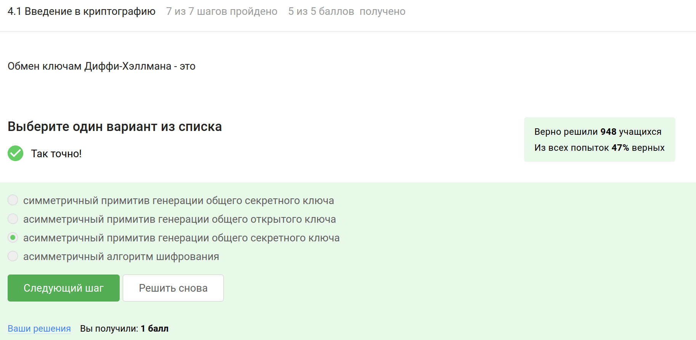

## Цифровая подпись

Протоколы электронной цифровой подписи используют асимметричное шифрование, при котором одна сторона создает цифровую подпись с помощью своего секретного ключа, а другая сторона может проверить подпись с использованием публичного ключа.

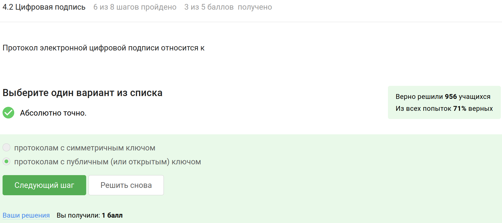

Алгоритм верификации электронной цифровой подписи использует подписанное сообщение, открытый ключ отправителя и саму подпись для проверки подлинности и целостности сообщения. Секретный ключ в этом процессе не используется, поскольку он предназначен только для создания подписи. 

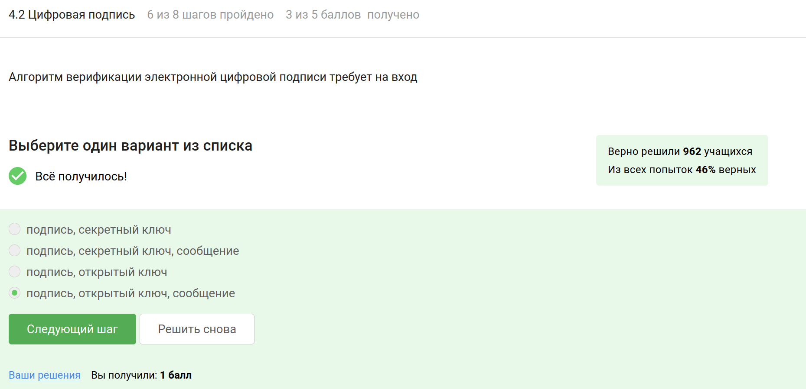

Электронная цифровая подпись обеспечивает аутентификацию, целостность и неотказ от авторства, однако сама по себе не защищает конфиденциальность сообщения.

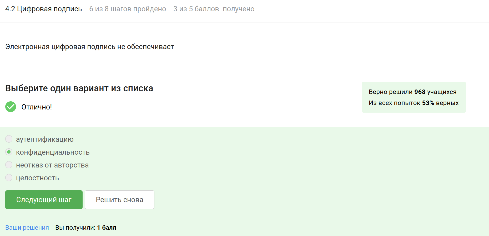

Для отправки налоговой отчетности в ФНС требуется усиленная квалифицированная электронная подпись, так как она соответствует требованиям законодательства и обеспечивает высокий уровень защиты и аутентичности данных. 

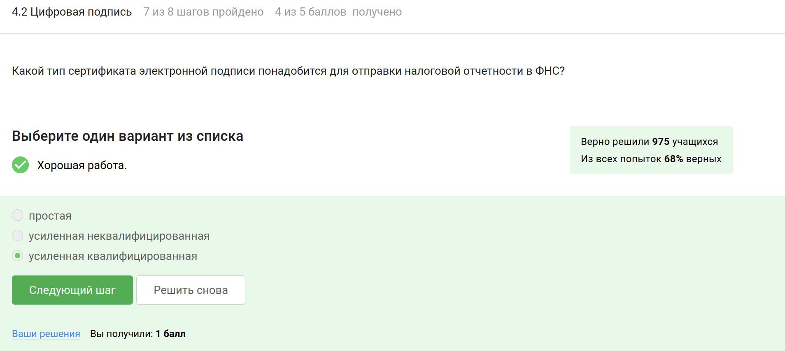

Квалифицированный сертификат ключа проверки электронной подписи может быть получен только в сертификационном центре, который имеет право выдавать такие сертификаты в соответствии с законодательством.

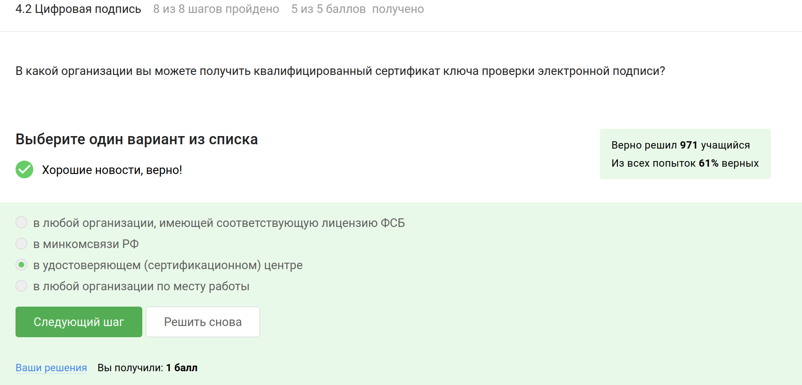

## Электронные платежи

МИР —  национальная платежная система России, MasterCard — международная платежная система, предоставляющая услуги по обработке платежей.

Ответы на скриноште - это пример многофакторной аутентификации, так как они включают два различных фактора: что-то, что пользователь знает (пароль), и что-то, что у него есть (код, отправленный по SMS).

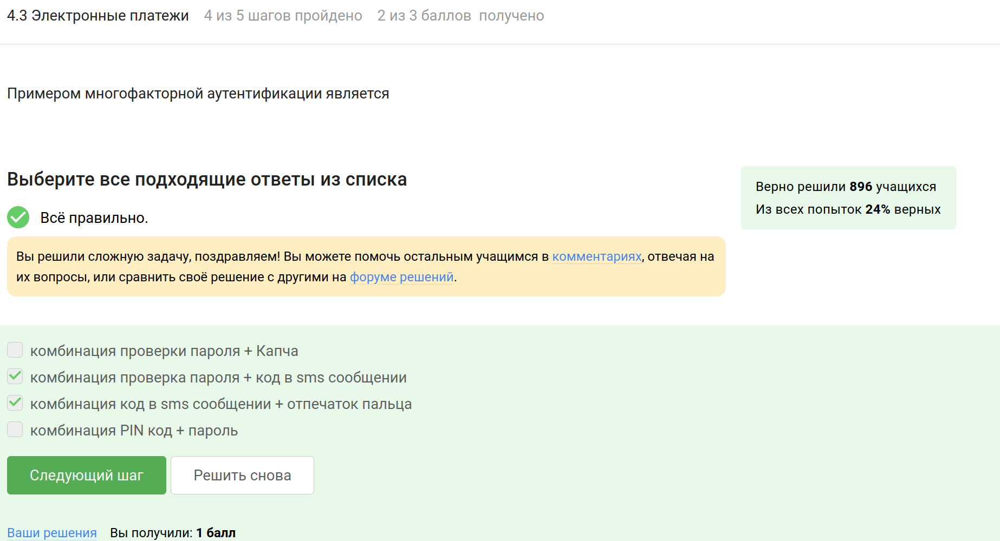

При онлайн-платежах часто используется многофакторная аутентификация, чтобы повысить уровень безопасности транзакций, сочетая различные методы проверки, такие как пароли, коды из SMS и другие способы идентификации, чтобы подтвердить личность покупателя перед банком-эквайером. 

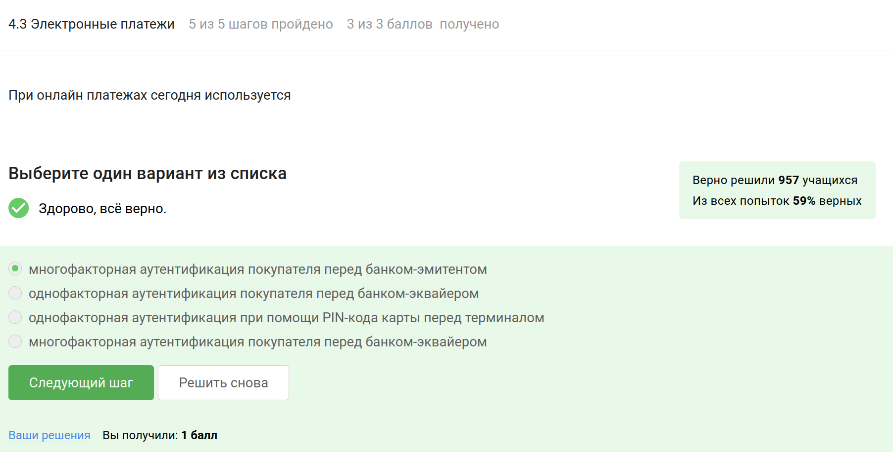

## Блокчейн

Это свойство криптографической хэш-функции используется в доказательстве работы (Proof of Work) для обеспечения безопасности и предотвращения мошенничества в блокчейне.

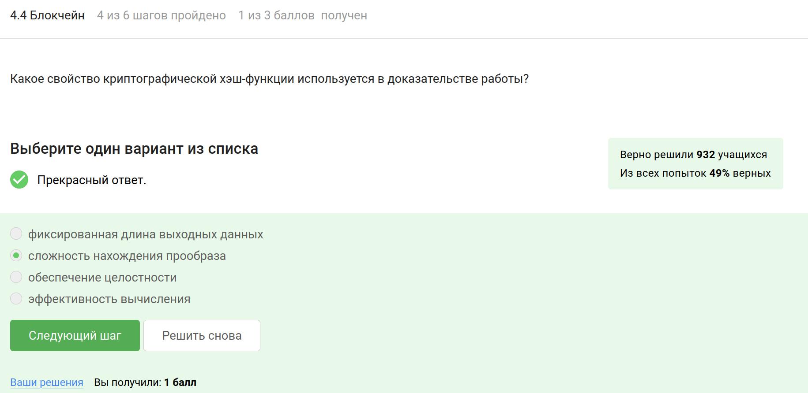

Все три свойства важны для достижения консенсуса в блокчейн-системах :

1. Постоянство — данные в блокчейне остаются неизменными после подтверждения, что гарантирует их целостность;

2. Открытость — большинство систем блокчейн имеют открытый исходный код и прозрачные механизмы, что позволяет любому участнику сети проверять и верифицировать транзакции;

3. Живучесть — системы блокчейн должны быть устойчивыми к сбоям и атакам, то есть продолжать функционировать даже при присутствии злонамеренных участников 

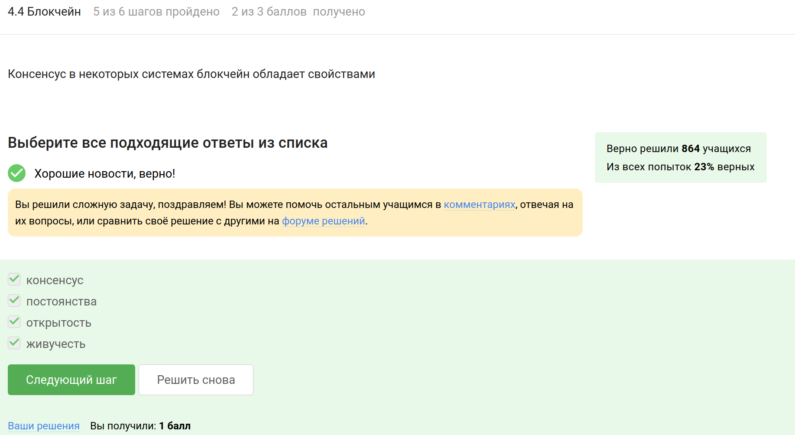

Участники блокчейна используют секретные ключи для создания цифровых подписей, которые подтверждают подлинность и целостность транзакций.

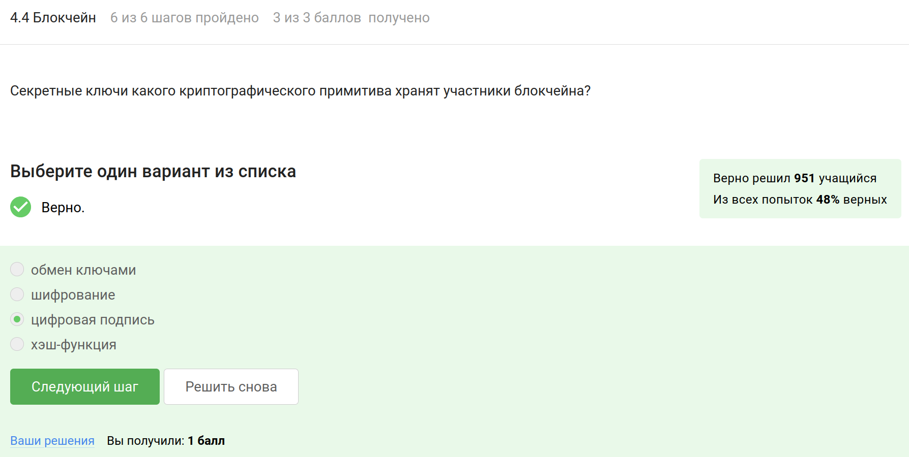

# Выводы

Я прошла третий этап "Криптография на практике" внешнего курса "Основы кибербезопасности" и научилась различать основные криптографические протоколы – симметричное шифрование, аутентификацю, цифровую подпись и хэширование

